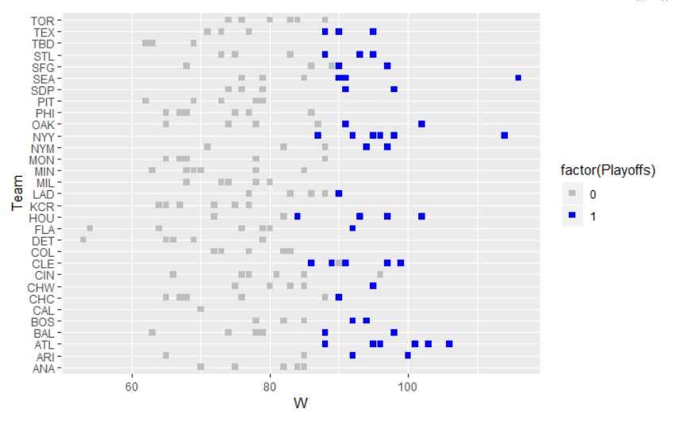

# Moneyball

This project is inspired from the movie 'Moneyball' starring Brad Pitt, based on the novel by Micheal Lewis.

Typically, baseball teams identify talent by scouting which was based on traditional stats such as speed, hitting ability, mental toughness etc. Billy Beane, the sports manager of Oakland Athletics (with the help of Paul DePodesta) adopted a completely different approach based on statistical analysis. The A's identified that 'Batting Average' was an overvalued stat and instead focused on 'On-Base Percentage' and 'Slugging Percentage'. Their methods were game-changing (pun-intended!) not just for baseball, but for sports analytics.

It's fascinating to see that their analysis was based on linear regression with two features, and not too complex. Simple ideas can lead to powerful outcomes!

[Dataset](https://www.kaggle.com/wduckett/moneyball-mlb-stats-19622012) for analysis is taken from kaggle.com. Code can be viewed in the moneyball.R file in this repository.

