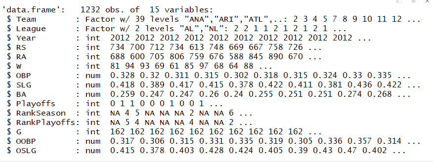
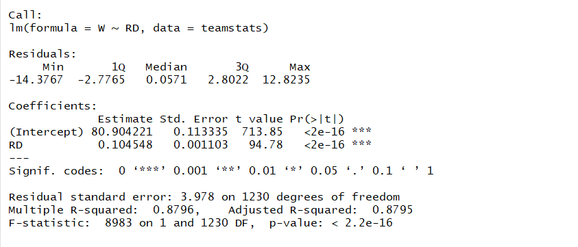
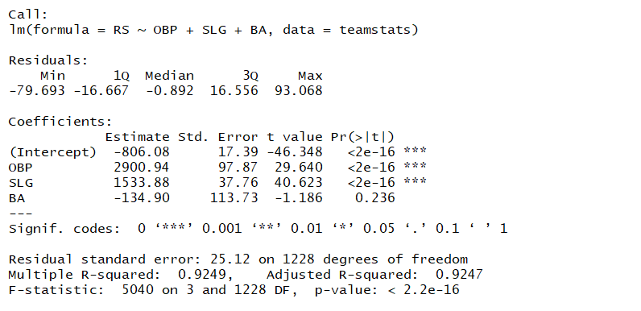
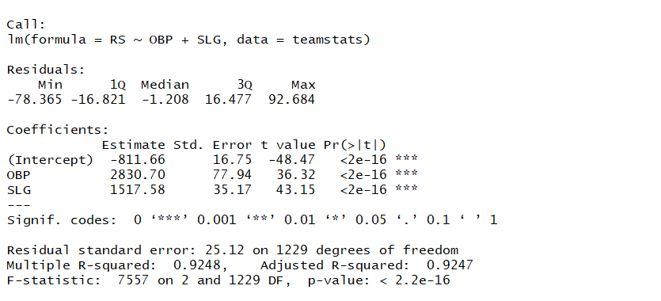
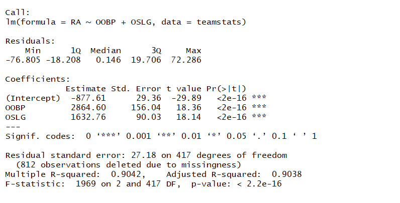

# Introduction

This project is inspired from the movie 'Moneyball' starring Brad Pitt, based on the novel by Micheal Lewis.

Typically, baseball teams identify talent by scouting which was based on traditional stats such as speed, hitting ability, mental toughness etc. Billy Beane, the sports manager of Oakland Athletics (with the help of Paul DePodesta) adopted a completely different approach based on statistical analysis. The A's identified that 'Batting Average' was an overvalued stat and instead focused on 'On-Base Percentage' and 'Slugging Percentage'. Their methods were game-changing (pun-intended!) not just for baseball, but for sports analytics.

It's fascinating to see that their analysis was based on linear regression with two features, and not too complex. Simple ideas can lead to powerful outcomes!

[Dataset](https://www.kaggle.com/wduckett/moneyball-mlb-stats-19622012) for analysis is taken from kaggle.com. Code can be viewed in the moneyball.R file in this repository.

# Analysis

Below is a scatter plot of whether a team made it to play-offs vs number of wins for 1996-2001 data. Based on this, the A's determined that to make it to the play-offs - they needed to have atleast 95 wins in the season.

To win 95 games, how many runs do they need to score? The A's did not merely look at runs scored, but also at runs allowed. Run difference = Runs scored - Runs allowed. A linear regression model is created for number of wins based on Run difference.

<b>Regression 1</b>

From the linear regression model above,
W = 80.9+0.1*RD

To win more than 95 games and make it to the play-offs, Run Difference needs to be 133.5. Which means, the A's needed to score about 135 runs more than what they allow.

The A's also used linear regression to find out which batting stats were more important. Traditionally, batting averages (BA) was considered. But the A's established that On-Base Percentage (OBP) and Slugging Percentage (SLG) were more important and BA was overvalued.

Regression model is created for all 3 features below - BA, OBP and SLG.

<b>Regression 2</b>

We get a decent R square value of 0.92.
The coefficient for BA is negative which is strange - because it means that teams with higher batting averages have lower runs scored. It's possible that this is because of multicollinearity and we would have to remove a variable since they're strongly correlated.

We remove BA because it is the least significant variable and recreate the regression model.

<b>Regression 3</b>

The R square value is still the same, and we get a better model by removing BA.

The linear regression equation is:
RS = -811.6 + 2830.7 * OBP + 1517 * SLG

Since eventually we make predictions based on RD, not RS, we need to create a similar regression model for RA.

<b>Regression 4</b>

We get the equation for RA below:
RA = -877.61+ 2864.6 * OOBP + 1632 * OSLG

For 2001, stats are OBP=0.339, SLG=0.430, OOBP=0.307, OSLG=3.73.
Using both equations for RS and RA, we get 805 and 622. 

Number of wins W = 100 based on the first equation. This is close to the actual number of wins for A's in 2002, which is 103!
